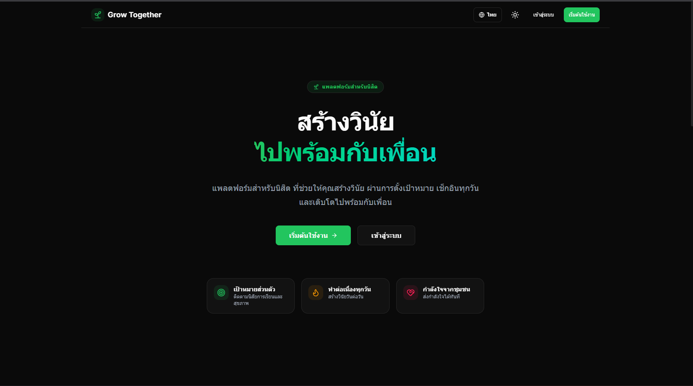
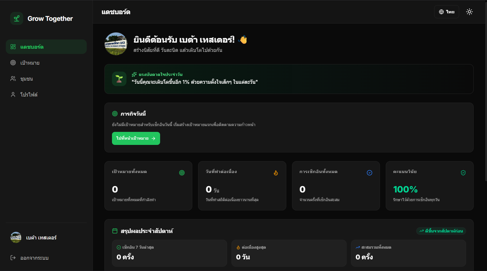

<p align="center">
  
</p>

# 🌱 Grow Together

> **แพลตฟอร์มสำหรับนิสิต เพื่อการพัฒนาตนเองผ่านการตั้งเป้าหมาย เช็กอินทุกวัน และสร้างวินัยร่วมกัน**

Grow Together เป็นเว็บแอปพลิเคชันที่ช่วยให้นิสิตสามารถตั้งเป้าหมาย ติดตามความก้าวหน้า และได้รับกำลังใจจากเพื่อนอย่างสม่ำเสมอ เพื่อสร้างแรงจูงใจในการพัฒนาตนเองวันละนิดแบบยั่งยืน

---

## 📸 ตัวอย่างหน้าจอการใช้งาน (Screenshots)

### Landing Page

<p align="center">
  
</p>

### Dashboard

<p align="center">
  
</p>


---

## ✨ แนวคิดของโครงการ

หลายคนเริ่มต้นตั้งเป้าหมายได้ดี แต่ขาดความต่อเนื่องเนื่องจากไม่มีพื้นที่สำหรับส่งเสริมวินัย Grow Together ถูกพัฒนาขึ้นเพื่อสร้างสภาพแวดล้อมที่ช่วยให้นิสิต:

- 🎯 **ตั้งเป้าหมายได้อิสระ**: ด้านการเรียน สุขภาพ การเงิน หรือการพัฒนาตนเอง
- 📈 **ติดตามคะแนนวินัย (Discipline Score)**: และสถิติการเช็กอินย้อนหลัง 30 วันแบบ Heatmap
- ❤️ **ส่งกำลังใจวันละครั้ง**: ช่วยสนับสนุนเป้าหมายของเพื่อนในชุมชนอย่างสงบและสม่ำเสมอ
- 🤝 **เติบโตไปพร้อมกัน**: โดยไม่มีโซเชียลฟีดที่รบกวนสมาธิ

---

## 🚀 ฟีเจอร์หลัก

### 👤 ระบบบัญชีผู้ใช้ & ความปลอดภัย
- สมัครสมาชิกด้วยรหัสนิสิตและรหัสผ่าน
- เข้าสู่ระบบ และ ออกจากระบบ
- เปลี่ยนรหัสผ่านพร้อมระบบเปิด-ปิดการมองเห็นรหัสผ่าน (Show / Hide Password)
- จัดการและอัปโหลดรูปโปรไฟล์

### 🎯 ระบบจัดการเป้าหมาย
- สร้าง แก้ไข และลบเป้าหมาย
- เช็กอินประจำวันด้วยคลิกเดียว
- ติดตามวันทำต่อเนื่องสูงสุด (Best Streak)
- แสดงคะแนนวินัย (Discipline Score) 0–100%

### 👥 ระบบชุมชน & ผู้ส่งกำลังใจล่าสุด
- ดูเป้าหมายของเพื่อนนิสิตในระบบ
- ส่งกำลังใจได้วันละ 1 ครั้งต่อเป้าหมาย
- แสดงจำนวนผู้ส่งกำลังใจสะสม (Lifetime Support Count)
- แสดงแถบรูปโปรไฟล์ซ้อนกัน (Overlapping Avatars) และรายนามผู้ส่งกำลังใจล่าสุด (Recent Supporters)
- การแจ้งเตือนเมื่อมีเพื่อนส่งกำลังใจให้เป้าหมาย

---

## 🛠 เทคโนโลยีที่ใช้

### Frontend
- **Framework**: React 19 + TypeScript + Vite
- **Styling**: Tailwind CSS + Radix UI Primitives
- **Animations**: Framer Motion
- **Icons**: Lucide React
- **Routing**: React Router v8 (SPA with Vercel Rewrites)

### Backend & Database
- **Authentication**: Supabase Auth (JWT & Password Hashing)
- **Database**: PostgreSQL (Supabase) with Row Level Security (RLS)
- **Storage**: Supabase Storage Buckets (Avatars)

---

## 🗄 โครงสร้างฐานข้อมูล (Database Schema)

```
profiles (ข้อมูลโปรไฟล์นิสิต)
   │
   ├── goals (เป้าหมายนิสิต)
   │     ├── daily_checkins (สถิติการเช็กอินรายวัน)
   │     └── supports (บันทึกการส่งกำลังใจรายวัน)
   │
   ├── supports (กำลังใจที่ส่งให้เพื่อน)
   └── notifications (การแจ้งเตือนกำลังใจ)
```

---

## 💻 การติดตั้งและเริ่มต้นใช้งาน local

```bash
# 1. Clone repository
git clone https://github.com/WeirCNT/Grow-together.git
cd Grow-together

# 2. ติดตั้ง Dependencies
npm install

# 3. รัน Development Server
npm run dev
```

---

## ⚙️ Environment Variables

สร้างไฟล์ `.env` ใน root directory:

```env
VITE_SUPABASE_URL=YOUR_SUPABASE_URL
VITE_SUPABASE_ANON_KEY=YOUR_SUPABASE_ANON_KEY
```

---

## 🌐 Live Application

**Production URL**: [https://grow-together-puce.vercel.app](https://grow-together-puce.vercel.app)

---

## 👨‍💻 ผู้พัฒนา

**ส.ณ.ชนาธิป ชูคันหอม (Weir)**  
โครงการพัฒนามนุษย์  
ศูนย์พุทธศาสตร์ศึกษา DCI

---

## 📄 License

MIT License © 2026 Grow Together